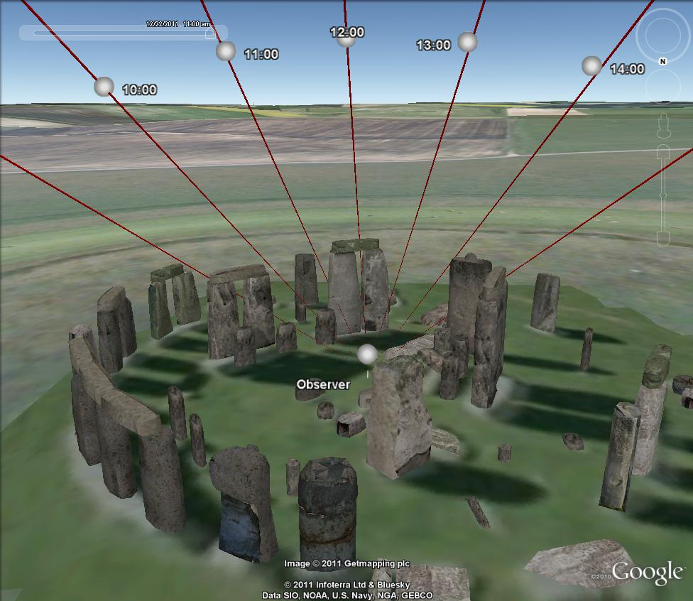

Misc Examples
======================

Example - Using pyKML to visualize ephemeris data
-------------------------------------------------

The following example demonstrates how pyKML can be used visualize geospatial 
data generated by another Python library, PyEphem_, which computes the 
positions of astronomical objects for locations on the earth surface at 
specific points in time.  The script below uses pyKML to generate a
KML file that shows solar ephemeris data for an observer at Stonehenge 
during the winter solstice.

The KML document contains a series of folders corresponding to various times
throughout the day on the winter solstice.  Within each folder, you can click on 
either the observer placemark (symbolized with a sphere) or the `Sun View` 
placemark to adjust the viewpoint.  Note that many of the objects contain 
timestamp elements, so you  may need to adjust Google Earth's time slider in 
order to view the objects.

Note that the KML refers to an external 3-D model file.
Download the 3-D model file into the same folder as the KML file.

Downloads:

* pyKML script: :download:`pyephem_example.py <../../../src/examples/misc/pyephem/pyephem_example.py>`
* KML output: :download:`stonehenge_example_output.kml <pyephem_example/stonehenge_example_output.kml>`
* 3-D model: :download:`unit_cone_red.dae <../../../src/examples/misc/pyephem/unit_cone_red.dae>`

.. _PyEphem: http://rhodesmill.org/pyephem/

   Screenshot showing ephemeris data for an observer at Stonehenge.

.. literalinclude:: ../../../src/examples/misc/pyephem/pyephem_example.py

